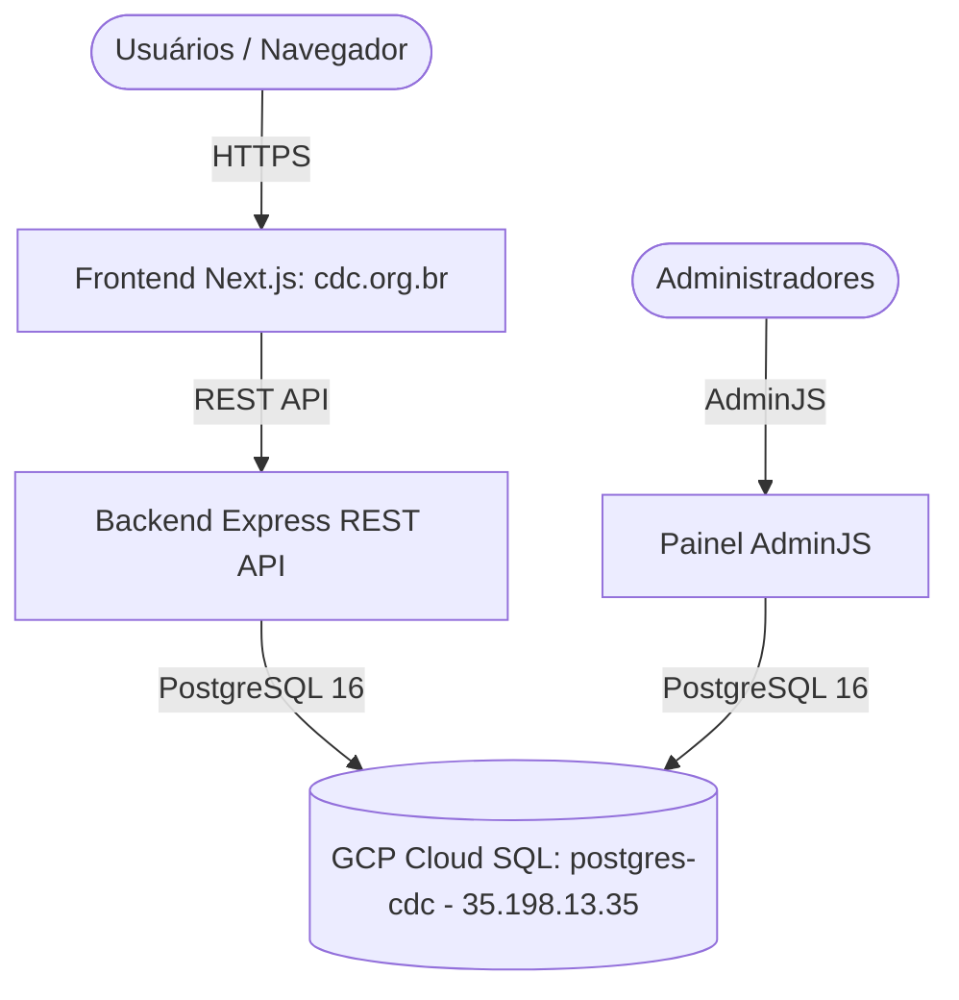
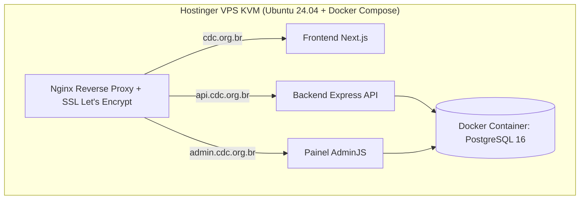

# 📋 Inquérito de Viabilidade & Plano de Migração (GCP ➔ Hostinger)
## Repositório: `site-cdc` (`cdc-org-2025/site-cdc`)

> **Status:** Instância de Banco PostgreSQL Auditada (`postgres-cdc`)  
> **Data:** 29 de Julho de 2026  
> **Banco Cloud SQL:** `postgres-cdc` (PostgreSQL 16 | IP: `35.198.13.35` | Região: `southamerica-east1-c`)  

---

## 1. Mapeamento dos Recursos GCP do Site (`cdc.org.br`)

### Inventário de Banco de Dados GCP:
- **Instância Cloud SQL**: `postgres-cdc`
- **Versão**: PostgreSQL 16
- **IP Público**: `35.198.13.35`
- **Localização**: `southamerica-east1-c` (São Paulo)
- **Status**: `RUNNABLE` (Ativo)

---

## 2. Estratégia de Migração para a Hostinger VPS

---

## 3. Roteiro Atualizado de Execução

- [x] **Instância Cloud SQL Localizada**: `postgres-cdc` (PostgreSQL 16 - `35.198.13.35`).
- [ ] **Dump do Banco PostgreSQL (`postgres-cdc`)**: Gerar backup `.sql` e baixar para o laboratório local.
- [ ] **Importação no Lab Local**: Subir o container `site_cdc_postgres` e restaurar o dump.
- [ ] **Deploy na Hostinger VPS**: Subir os serviços em produção na nova hospedagem.
