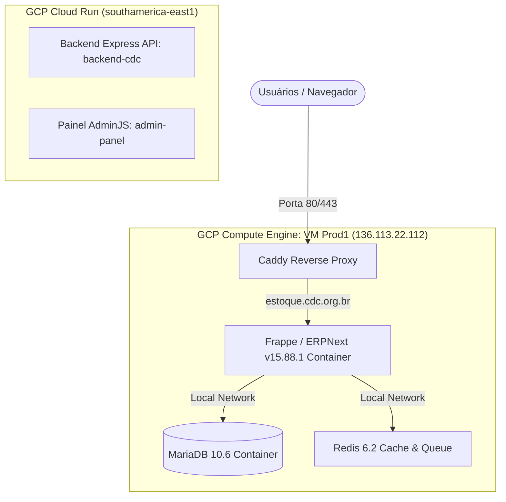
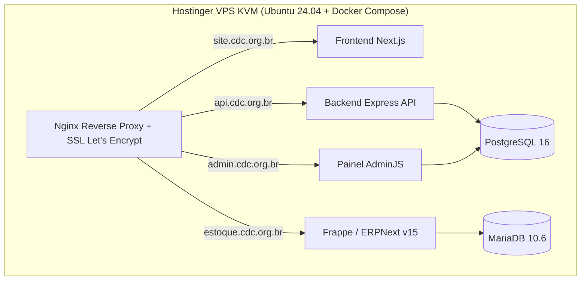

# 📋 Inquérito de Viabilidade & Plano de Migração (GCP ➔ Hostinger)
## Repositório: `site-cdc` (`cdc-org-2025/site-cdc`)

> **Status:** Diagnóstico de Servidor Concluído (Fase 1 - Produção GCP Auditada)  
> **Data:** 28 de Julho de 2026  
> **VM GCP Auditada:** `Prod1` (`136.113.22.112`)  

---

## 1. Mapeamento da Infraestrutura Real (GCP `Prod1`)

Após o acesso SSH realizado com sucesso na VM `Prod1` (`136.113.22.112`), identificamos os seguintes serviços em execução:

### Inventário de Serviços da VM `Prod1`:
1. **`estoque.cdc.org.br`**: Sistema **ERPNext v15** (Frappe Framework) rodando em containers Docker (`frappe/erpnext:v15.88.1` + `mariadb:10.6` + `redis:6.2`).
2. **Reverse Proxy**: **Caddy Web Server** (`/etc/caddy/Caddyfile`) roteando o domínio `estoque.cdc.org.br` para o container.
3. **Usuários do Sistema**: `/home/dxcdc`, `/home/gt_transformadigital` e `/home/kleberdev97`.
4. **Projeto GCP**: `cdc-org` (Conta de serviço: `427143287446-compute@developer.gserviceaccount.com`).

---

## 2. Estratégia de Migração para a Hostinger VPS

Como a VM `Prod1` abriga o **ERPNext / MariaDB (`estoque.cdc.org.br`)** e os microsserviços do **Site CDC (`site-cdc`)** rodam no Cloud Run:

### Benefícios da Consolidação na Hostinger VPS:
- **Redução Massiva de Custos**: Substituição das cobranças em dólar da GCP (Compute Engine + Cloud Run + Cloud SQL) por uma **única assinatura Hostinger VPS KVM**.
- **Orquestração Única**: Todos os ecossistemas (Site CDC e Estoque ERPNext) rodando em Docker Compose no mesmo servidor com proxy Nginx.

---

## 3. Roteiro Atualizado de Execução

- [x] **Conexão SSH na VM Prod1 (`136.113.22.112`)**: Autenticação com chave SSH `id_ed25519` (Concluído com sucesso).
- [x] **Diagnóstico dos Serviços Ativos**: Identificados MariaDB 10.6, ERPNext v15 e Caddy Proxy.
- [ ] **Backup do Banco de Dados MariaDB (`estoque.cdc.org.br`)**: Gerar dump `.sql` dos dados do ERPNext.
- [ ] **Backup do Banco de Dados Cloud SQL PostgreSQL (`site-cdc`)**: Exportar tabelas da API e Painel Admin.
- [ ] **Transferência para Hostinger VPS**: Subir os serviços via `docker-compose.yml` na nova hospedagem.
