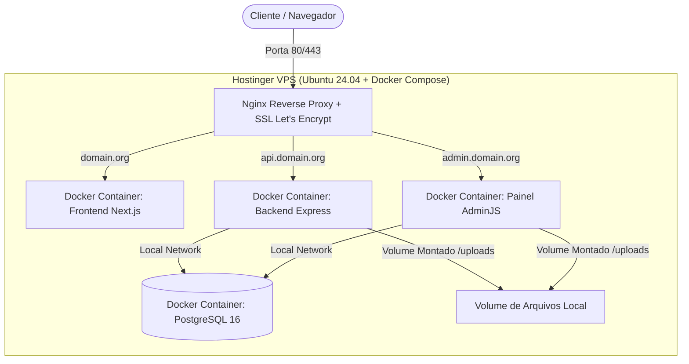

# 📋 Inquérito de Viabilidade & Plano de Migração (GCP ➔ Hostinger)
## Repositório: `site-cdc` (`cdc-org-2025/site-cdc`)

> **Status:** Em Análise de Viabilidade (Fase 1)  
> **Data:** 28 de Julho de 2026  
> **Autor:** Antigravity (Pair Programming AI) & Equipe CDC  

---

## 1. Contexto & Diagnóstico da Infraestrutura Atual (GCP)

Após auditoria do código-fonte no repositório `site-cdc`, identificamos que o projeto é composto por 3 aplicações distintas e 4 serviços gerenciados da Google Cloud Platform:

```mermaid
graph TD
    User([Usuários / Navegador]) -->|HTTPS| Frontend[Frontend Next.js 14]
    Admin([Administradores]) -->|HTTPS / OAuth| AdminPanel[Painel Admin AdminJS]
    
    Frontend -->|REST API| Backend[Backend Node.js / Express 5]
    AdminPanel -->|Sequelize ORM| CloudSQL[(GCP Cloud SQL PostgreSQL)]
    Backend -->|Sequelize ORM| CloudSQL
    
    Backend -->|@google-cloud/storage| GCS[(GCP Storage Buckets)]
    AdminPanel -->|@adminjs/upload| GCS
    AdminPanel -->|passport-google-oauth20| GCPAuth[Google OAuth 2.0]
    
    subgraph "GCP Cloud Run (southamerica-east1)"
        Backend
        AdminPanel
    end
```

### Componentes Identificados:
1. **Frontend (`/frontend`)**: Aplicação **Next.js 14** (React 18, TypeScript, Axios, MUI, Emotion).
2. **Backend (`/backend`)**: API REST em **Node.js (Express 5)**, **Sequelize ORM**, `pg` (PostgreSQL), `multer` e `@google-cloud/storage`.
3. **Painel Administrativo (`/painel-admin`)**: **AdminJS 7**, **Passport Google OAuth 2.0**, `@adminjs/upload` com armazenamento em GCS.
4. **Banco de Dados**: **Google Cloud SQL (PostgreSQL)** acessado via `--add-cloudsql-instances`.
5. **Segredos & CI/CD**: **GCP Secret Manager** + **GCP Cloud Build** (`cloudbuild.yaml`).

---

## 2. Matriz de Viabilidade & Desafios da Migração para Hostinger

| Recurso GCP Atual | Equivalente Recomendado na Hostinger | Nível de Esforço | Viabilidade | Observações Técnicas |
| :--- | :--- | :--- | :--- | :--- |
| **GCP Cloud Run** (Containers Serverless) | **Hostinger VPS KVM** (Docker + Nginx Reverse Proxy) | 🟡 Médio | ✅ 100% Viável | O hospedagem compartilhada da Hostinger não suporta múltiplos serviços Node.js + AdminJS. Uma **VPS KVM (Ubuntu 24.04 + Docker Compose)** é ideal. |
| **Cloud SQL** (PostgreSQL Gerenciado) | **PostgreSQL no Docker (VPS)** ou **DB Gerenciado** | 🟡 Médio | ✅ 100% Viável | Exportar dump `.sql` do Cloud SQL e restaurar no PostgreSQL containerizado com volume persistente. |
| **Google Cloud Storage** (GCS Buckets) | **Armazenamento Local (Docker Volume)** ou **Cloudflare R2 / S3** | 🟡 Médio | ✅ 100% Viável | Ajustar o provider do `@adminjs/upload` e do `backend` para driver de sistema de arquivos local ou S3/R2 gratuito. |
| **GCP Secret Manager** | **Arquivo `.env` Protegido / Docker Secrets** | 🟢 Baixo | ✅ 100% Viável | Armazenamento de variáveis de ambiente no servidor Hostinger VPS. |
| **Google OAuth 2.0** | **Manter Google OAuth 2.0** | 🟢 Baixo | ✅ 100% Viável | Não precisa mudar de provedor; basta atualizar os URLs de Redirecionamento no Google Cloud Console (`https://admin.seudominio.org/...`). |
| **GCP Cloud Build** | **GitHub Actions CI/CD** | 🟡 Médio | ✅ 100% Viável | Criar workflow em `.github/workflows/deploy.yml` para SSH + Docker Compose `up -d` automático a cada commit. |

---

## 3. Arquitetura Alvo Proposta na Hostinger



---

## 4. Plano Executivo em 6 Etapas (Roteiro do Inquérito ao Deploy)

### 🔹 Etapa 1: Inquérito & Inventário (FASE ATUAL - CONCLUÍDA)
- [x] Clonar repositório e configurar remote SSH `git@github.com:cdc-org-2025/site-cdc.git`.
- [x] Mapear serviços: Next.js (Frontend), Express (Backend), AdminJS (Painel), Cloud SQL (PostgreSQL), GCS (Storage).
- [x] Validar que o plano ideal da Hostinger é **VPS (Hostinger KVM 2 ou KVM 4)**.

### 🔹 Etapa 2: Preparação do Ambiente Hostinger & Dockerization Local
- [ ] Criar `docker-compose.yml` unificado no repositório integrando:
  - `frontend` (Next.js)
  - `backend` (Express)
  - `painel-admin` (AdminJS)
  - `postgres` (PostgreSQL 16)
  - `nginx` (Proxy Reverso)
- [ ] Criar adaptador de upload de arquivos (substituir `@google-cloud/storage` por Armazenamento Local / S3-compatible se necessário).

### 🔹 Etapa 3: Contratação e Setup da VPS Hostinger
- [ ] Provisionar VPS KVM na Hostinger com Ubuntu 24.04 LTS.
- [ ] Instalar Docker, Docker Compose e Git na VPS Hostinger.
- [ ] Configurar chave SSH de deploy para conexão segura via terminal/CI.

### 🔹 Etapa 4: Migração de Dados (Dump & Restore)
- [ ] Gerar backup/dump completo do banco PostgreSQL no GCP Cloud SQL (`pg_dump`).
- [ ] Importar dump para a instância PostgreSQL na Hostinger VPS (`pg_restore`).
- [ ] Sincronizar arquivos estáticos/mídias do GCS Bucket para a pasta de uploads da VPS (`gcloud storage cp` ou `rclone`).

### 🔹 Etapa 5: Validação em Homologação (Staging / Prova de Conceito)
- [ ] Testar todos os endpoints da API Backend, rotas do Next.js e login Google OAuth no AdminJS em ambiente de staging na Hostinger.
- [ ] Validar upload de imagens, envio de e-mails (`nodemailer`) e conexão com o banco de dados.

### 🔹 Etapa 6: Virada de Chave (Cutover), Automação CI/CD e Descomissionamento GCP
- [ ] Apontar registros DNS (A / CNAME) da Hostinger/Cloudflare para o IP da VPS.
- [ ] Gerar certificados SSL HTTPS via Certbot / Let's Encrypt no Nginx.
- [ ] Configurar GitHub Actions (`.github/workflows/deploy.yml`) para deploy automático via SSH.
- [ ] Realizar backup final de segurança da GCP e desligar instâncias no Cloud Run e Cloud SQL para zera custos GCP.

---

## 5. Próximos Passos Recomendados

1. **Revisar este Inquérito de Viabilidade** com a equipe CDC.
2. **Definir se a Hostinger VPS já está contratada** (se sim, obter IP e acesso SSH).
3. **Iniciar Etapa 2**: Criar os arquivos de containerização `docker-compose.yml` e scripts de deploy no repositório.
