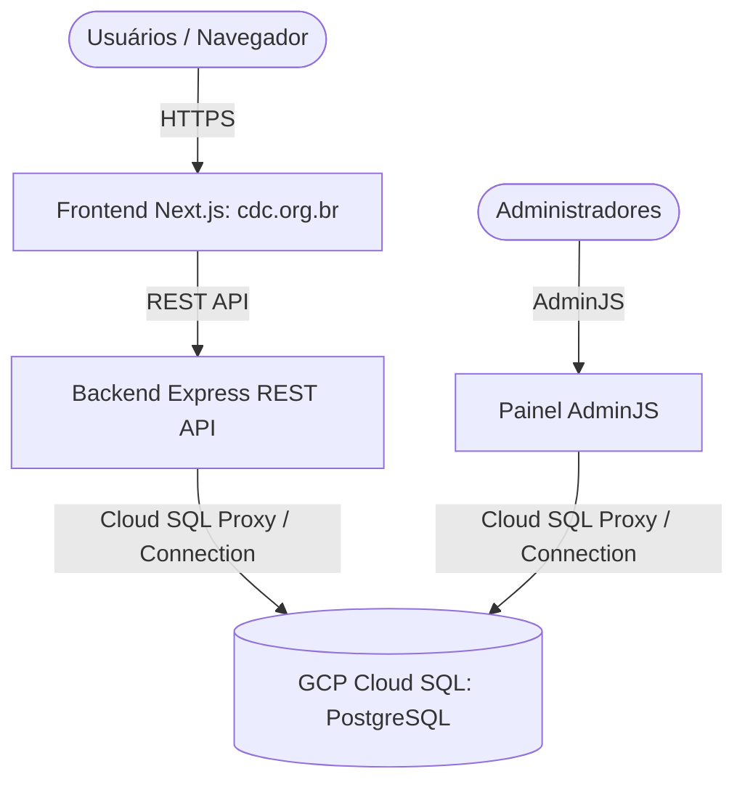
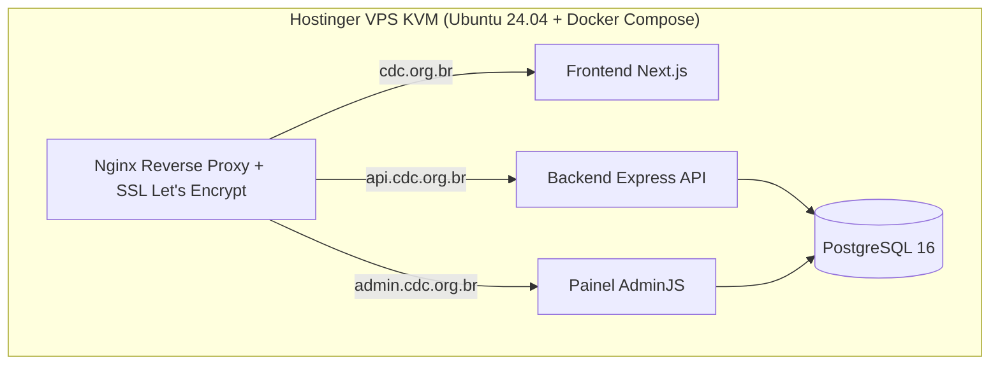

# 📋 Inquérito de Viabilidade & Plano de Migração (GCP ➔ Hostinger)
## Repositório: `site-cdc` (`cdc-org-2025/site-cdc`)

> **Status:** IP do Servidor GCP Atualizado  
> **Data:** 29 de Julho de 2026  
> **IP Oficial GCP:** `34.151.249.199` (Região `southamerica-east1`)  

---

## 1. Arquitetura da Infraestrutura Atual (`34.151.249.199`)

### Registros Atualizados:
- **IP do Servidor de Produção GCP**: `34.151.249.199`
- **IP Antigo Desconsiderado**: `136.113.22.112`

---

## 2. Estratégia de Migração para a Hostinger VPS

---

## 3. Roteiro Atualizado de Execução

- [x] **IP Oficial GCP Registrado**: `34.151.249.199` (Atualizado).
- [ ] **Mapeamento da VM no Cloud Shell**: Rodar `gcloud compute instances list` no Cloud Shell para identificar o nome e zona da VM com IP `34.151.249.199`.
- [ ] **Backup do Banco PostgreSQL (`cdc.org.br`)**: Exportar tabelas da API e Painel Admin.
- [ ] **Transferência e Deploy na Hostinger VPS**: Subir os serviços via `docker-compose.yml`.
