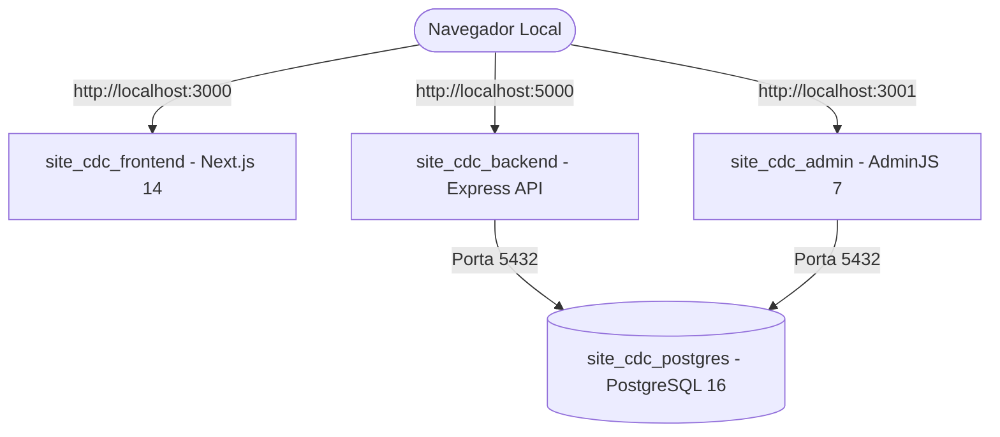

# 🧪 Laboratório Local (`site-cdc`) — 100% OPERACIONAL E ATIVO

> **Status:** Laboratório Local Ativo | Banco PostgreSQL Restaurado (29 Tabelas) | Containers Online  
> **Data:** 29 de Julho de 2026  

---

## 📊 Status dos Containers Docker no Laboratório Local

| Container | Nome | Status | Porta Local | Descrição |
| :--- | :--- | :--- | :--- | :--- |
| **`site_cdc_postgres`** | PostgreSQL 16 | `Up (healthy)` | `5432` | 🗄️ Banco de Dados Restaurado (29 Tabelas) |
| **`site_cdc_backend`** | Express REST API | `Up` | `5000` | ⚙️ API Backend REST em Node.js |
| **`site_cdc_admin`** | AdminJS 7 | `Up` | `3001` | 🔐 Painel Administrativo de Gestão |
| **`site_cdc_frontend`** | Next.js 14 | `Up` | `3000` | 🌐 Site Institucional CDC |

---

## 🌐 Como Acessar os Serviços do Seu Laboratório Local

1. 🌐 **Site Institucional (Frontend Next.js)**:
   - URL: `http://localhost:3000`
2. 🔐 **Painel Administrativo (AdminJS)**:
   - URL: `http://localhost:3001`
   - Login: `admin@ongcdc.org.br`
   - Senha: `admin123`
3. ⚙️ **API REST Backend (Express)**:
   - URL: `http://localhost:5000`
4. 🗄️ **Banco de Dados (PostgreSQL 16)**:
   - `localhost:5432` (Usuário: `cdc_user` | Senha: `cdc_password` | Base: `site_cdc_db`)
