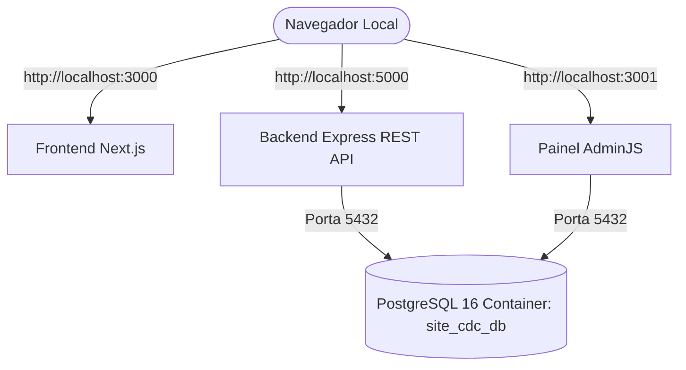

# 🧪 Plano do Laboratório Local (`site-cdc`)

> **Status:** Blindagem Git Concluída | Configuração `.env` Pronta | Restauração Pronta  
> **Data:** 29 de Julho de 2026  

---

## 🛡️ 1. Proteção contra Vazamento de Dados

- **Indexação `.gitignore`**: O padrão `*.sql` e `*.dump` foi inserido no `.gitignore` (Commit `18f4869`). O arquivo `backup_site_cdc_20260729.sql` (322 KB) está **100% protegido e invisível para o Git**.

---

## 🛠️ 2. Estrutura do Laboratório Local



---

## 🚀 3. Roteiro para Subir o Laboratório Local

### Passo 1: Abrir o Docker Desktop
Certifique-se de que o aplicativo **Docker Desktop** esteja iniciado no seu Windows.

### Passo 2: Subir o Container do PostgreSQL
No seu terminal local (PowerShell em `C:\Códigos\site-cdc`):

```powershell
docker compose up -d postgres
```

### Passo 3: Restaurar o Banco de Dados do Site (`322 KB`)
```powershell
docker exec -i site_cdc_postgres psql -U cdc_user -d site_cdc_db < C:\Códigos\site-cdc\backup_site_cdc_20260729.sql
```

### Passo 4: Subir Todos os Serviços (Backend, Admin, Frontend)
```powershell
docker compose up -d --build
```

---

## 🌐 4. Endereços do Laboratório Local

- 🌐 **Frontend (Next.js)**: `http://localhost:3000`
- ⚙️ **Backend API (Express)**: `http://localhost:5000`
- 🔐 **Painel AdminJS**: `http://localhost:3001` (Login: `admin@ongcdc.org.br` / Senha: `admin123`)
- 🗄️ **Banco PostgreSQL**: `localhost:5432`
