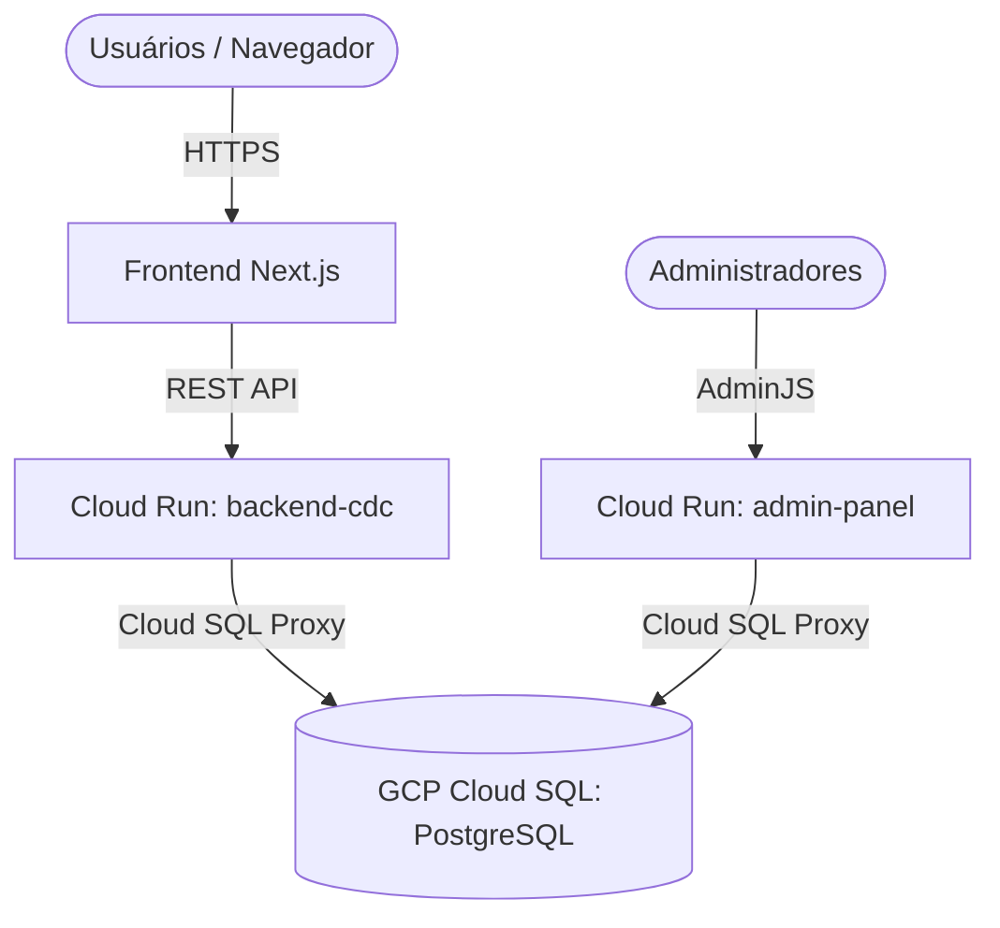

# 🎯 Plano de Backup & Laboratório Local: Site Institucional (`cdc.org.br`)

> **Foco Principal:** Backup do banco de dados PostgreSQL e mídias da aplicação **`cdc.org.br`** (Site CDC + Backend Express + Painel AdminJS).

---

## 📊 1. Arquitetura Atual do Site (`cdc.org.br`) na GCP



---

## 📋 2. Como Fazer o Backup do Banco PostgreSQL (`cdc.org.br`) na GCP

Como a API e o Painel Admin do site `cdc.org.br` rodam no **GCP Cloud Run** e o banco fica no **GCP Cloud SQL (PostgreSQL)**, temos 2 métodos para extrair o backup:

### 🔹 Método A: Via Terminal do Google Cloud (Cloud Shell)

No seu Cloud Shell (`@cloudshell`), execute os comandos:

#### 1. Listar o nome exato da instância Cloud SQL:
```bash
gcloud sql instances list
```

#### 2. Conectar diretamente ao banco PostgreSQL do site:
```bash
gcloud sql connect NOME_DA_INSTANCIA --user=postgres
```

#### 3. Gerar o dump completo do banco PostgreSQL (`site_cdc_db`):
```bash
gcloud sql export sql NOME_DA_INSTANCIA gs://<SEU_BUCKET>/backup_site_cdc.sql --database=ong-cdc
```

---

### 🔹 Método B: Via Console Web da GCP (Navegador)

1. Acesse o **Google Cloud Console ➔ SQL**.
2. Clique na instância do PostgreSQL do site (ex: `site-cdc-db` ou `ong-cdc-db`).
3. No menu superior, clique em **Exportar** (Export).
4. Selecione a opção **SQL**, escolha o banco `ong-cdc` (ou `site_cdc`) e salve no Cloud Storage para download.

---

## 🧠 3. Regras de Negócio do Site (`cdc.org.br`)

A aplicação do site `cdc.org.br` utiliza **Sequelize ORM** em Node.js com o banco PostgreSQL. As principais entidades de regras de negócio são:

1. **Notícias & Conteúdos**: Artigos, categorias, imagens de capa e banners institucionais.
2. **Projetos & Ações Sociais**: Páginas institucionais, metas e relatórios de impacto da ONG.
3. **Doações & Formulários**: Registros de apoiadores, formulários de contato e newsletters.
4. **Usuários Gestores (Painel AdminJS)**: Permissões de administradores e autenticação via Google OAuth 2.0.
